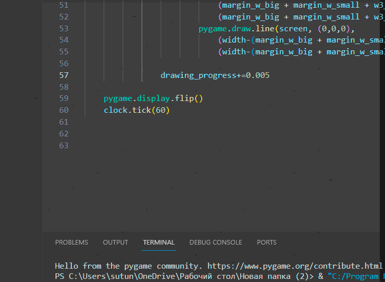
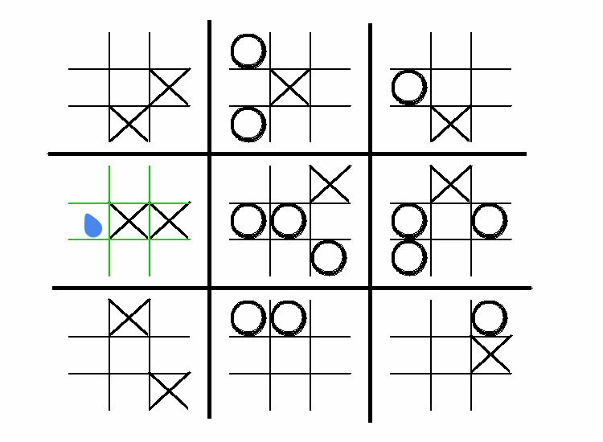

# Ultimate Tic-Tac-Toe
> You won a battle, but I have won the war.
 © Napoleon Bonaparte

Ultimate Tic-Tac-Toe is a rethinking of the
classic boring 3×3 tic-tac-toe. In order 
to win, you must be able to think 
outside the box and not to obsess over 
small victories.

## 9 in 1
The goal of the game is to collect three
captured fields in a line.
"Capturing a field" is basically the
winning on it. Your opponent has to make 
his turn on the field that is 
correspondent to the slot you've just ticked.

